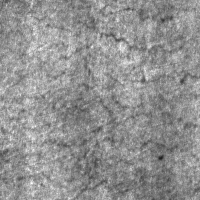
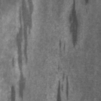
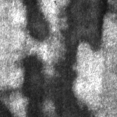
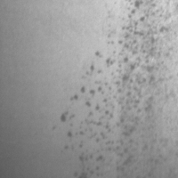
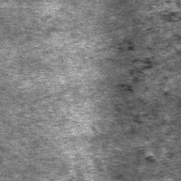
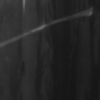

# Steel-Surface-Defect-Detector
This project was done as a part of the IITM course Artificial Intelligence in Manufacturing(ME6324).Here we try to solve the problem of identifying the different types of surface defects most commonly seen on hot rolled steel strips so that defective pieces can be easily identified and recycled.The dataset can be found here on [Kaggle](https://www.kaggle.com/fantacher/neu-metal-surface-defects-data). The six main defects are 
<ul>
  <li>Crazing</li>
  
  <li>Inclusion</li>
  
  <li>Patches</li>
  
  <li>Pitted Surfaces</li>
  
  <li>Rolled In Scale</li>
  
  <li>Scratches</li>
  
</ul>
<h3>Web App Demo</h3>
You can find the web app deployed on Heroku here <a href="https://steel-defect-classifier.herokuapp.com">Heroku App</a> 

https://user-images.githubusercontent.com/55657956/128661785-2ef3f421-af7d-4b22-9301-d1df4255a32a.mp4

